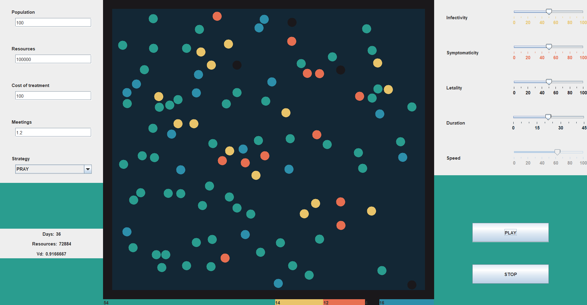

# Simulatore Epidemiologico ```1.0```

Simulatore epidemiologico realizzato per un esame universitario in gruppo

## Features

- **Input parameters**: Setup the simulator with custom data like:
    - Population
    - Resources
    - Cost of treatment
    - Average daily meetings
    - Virus infectivity
    - Virus symptomaticity
    - Virus letality
    - Virus duration
    - Strategy:
        - Pray (do nothing)
        - Half Random (stop random 50% of population)
        - Lazaretto (put infected people in an isolated area)
        - Random Swab (do some swab to random people)
        - Smart Swab (trace contacts of infected people and test them)
    - Speed simulation   
- **GUI**:              2D simulation of people interacting
- **Realtime status**: 
    - Day counter
    - Resources counter
    - Vd
    - People with colour based on their status in the 2D simulation (green: healty, yellow: infected, red: symptomatic, blue: healed, black: dead)

## Screenshots

